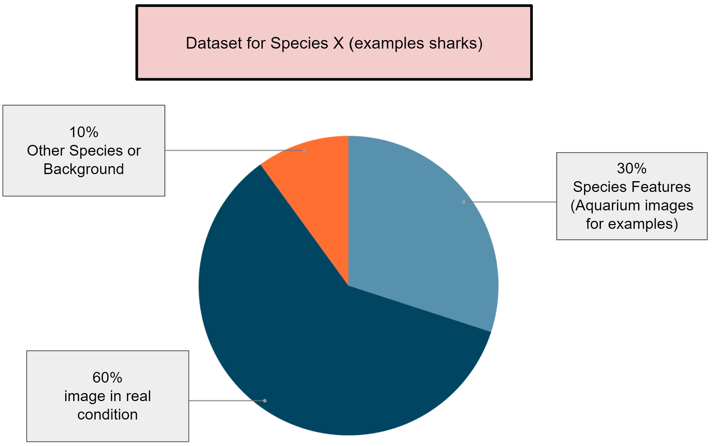
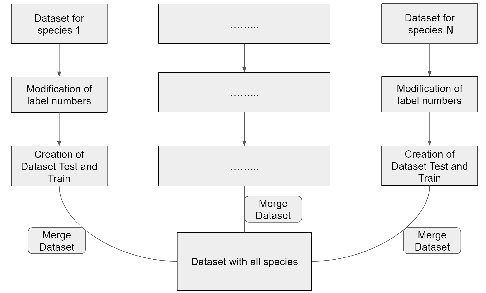

# Table of Contents

- [The Objective of This Project](#the-objective-of-this-project)
- [Creation of DataSet](#creation-of-dataset)
- [Training Phase and Result](#training-phase-and-result)
  - [The Metrics](#the-metrics)
  - [The Parameters](#the-parameters)
- [How to Use It](#how-to-use-it)
  - [Upgrade It](#upgrade-it)
  - [Inference It](#inference-it)
  - [Launch API](#launch-api)
- [📚 References](#-references)
  - [Datasets](#datasets)

## The objectif of this project

The main objective of this project is to allow real-time inference of underwater species. The Institucam films in real time, and the objective is to perform annotations in real time on the flow or to perform annotations on the samples where movement has been detected. To achieve this, I used the Tenaka model as a base and upgraded it to make it better suited for real conditions, such as detecting species under poor conditions, low-quality images, and so on. Additionally, I upgraded the model and created an API to improve the efficiency of treatment and avoid loading the model each time inference is performed.

## Creation of DataSet

The study and different tests that I can try to do show that the best results are achieved as follows. 30% of the dataset is used to show the features of the species, allowing the model to train on each species's particular features. This allows the model to know, for example, that sharks have some fins here, some gills here, etc. It also helps to avoid overfitting. Additionally, 10% of the dataset consists of other species to avoid overfitting and make the model better by forcing it to make some errors in predictions and recalibrate. Finally, 60% of the dataset is used in real conditions to train the model on what it will face in real life, especially when the buoys are set up on the water.

Then the creation of the global dataset is simple. I annotated some images for a given species, associated the correct class number in the configuration files and in the label files. Once I completed my dataset for each species that I wanted, I merged all of the datasets to create the global dataset with all the species.

<!--  -->

## Training Phase and Result

### the metrics

### the parameters

## How to use it

### Upgrade it

### inference it 

### Launch API

## 📚 References

### Datasets

- Ticon Dataset. (2023). Shark Dataset [ Open Source Dataset ]. In Roboflow Universe . Roboflow . https://universe.roboflow.com/ticon-dataset/shark-ibmby
- Minhajul Arefin. (2021).  zebra_shark Dataset  [ Open Source Dataset ]. In  Roboflow Universe .  Roboflow . https://universe.roboflow.com/minhajul-arefin/zebra_shark
- Rizal Fadia Al Fikri. (2022).  shark_species Dataset  [ Open Source Dataset ]. In  Roboflow Universe .  Roboflow . https://universe.roboflow.com/rizal-fadia-al-fikri/shark_species
- Aya Abd-Elnaser. (2022).  SHARK Dataset  [ Open Source Dataset ]. In  Roboflow Universe .  Roboflow . https://universe.roboflow.com/aya-abd-elnaser/shark-jatfb
- Nomi. (2023).  seaturtle Dataset  [ Open Source Dataset ]. In  Roboflow Universe .  Roboflow . https://universe.roboflow.com/nomi/seaturtle
- Parvej Hosen. (2022).  Turtle Dataset  [ Open Source Dataset ]. In  Roboflow Universe .  Roboflow . https://universe.roboflow.com/parvej-hosen/turtle-f9xgw
- Seami New 5 Fishes. (2023).  EagleRay New Dataset  [ Open Source Dataset ]. In  Roboflow Universe .  Roboflow . https://universe.roboflow.com/seami-new-5-fishes/eagleray-new
- Le Wagon. (2023).  count-a-manta Dataset  [ Open Source Dataset ]. In  Roboflow Universe .  Roboflow . https://universe.roboflow.com/le-wagon-w02yl/count-a-manta
- Renaldo Rasfuldi. (2022).  fish_id_2 Dataset  [ Open Source Dataset ]. In  Roboflow Universe .  Roboflow . https://universe.roboflow.com/renaldo-rasfuldi/fish_id_2
- Universiti Teknologi Malaysia. (2023).  Giant Clam Dataset  [ Open Source Dataset ]. In  Roboflow Universe .  Roboflow . https://universe.roboflow.com/universiti-teknologi-malaysia-juyvx/giant-clam
- Universiti Teknologi Malaysia. (2023).  Tioman Giant Clams Dataset  [ Open Source Dataset ]. In  Roboflow Universe .  Roboflow . https://universe.roboflow.com/universiti-teknologi-malaysia-juyvx/tioman-giant-clams
- Jacob Solawetz. (2023).  Fish Dataset  [ Open Source Dataset ]. In  Roboflow Universe .  Roboflow . https://universe.roboflow.com/roboflow-gw7yv/fish-yzfml
- Dataset. (2022).  Dataset Dataset  [ Open Source Dataset ]. In  Roboflow Universe .  Roboflow . https://universe.roboflow.com/dataset-gdypo/dataset-axhm3
- Addison Howard, W. K., Eunbyung Park. (2018). ImageNet Object Localization Challenge. Kaggle. https://kaggle.com/competitions/imagenet-object-localization-challenge
- Australian Institute of Marine Science (AIMS), University of Western Australia (UWA) and Curtin University. (2019), OzFish Dataset - Machine learning dataset for Baited Remote Underwater Video Stations, https://doi.org/10.25845/5e28f062c5097

### Model

- Jocher, G., Chaurasia, A., & Qiu, J. (2023). Ultralytics YOLO (Version 8.0.0) [Computer software]. https://github.com/ultralytics/ultralytics

### Software

- Charles, Eléonore. (2024). marine-detect: Object Detection Models for Identifying Species in Marine Environments [Software]. Version 0.0.1. AGPL-3.0. [https://github.com/Orange-OpenSource/marine-detect](https://github.com/Orange-OpenSource/marine-detect)
