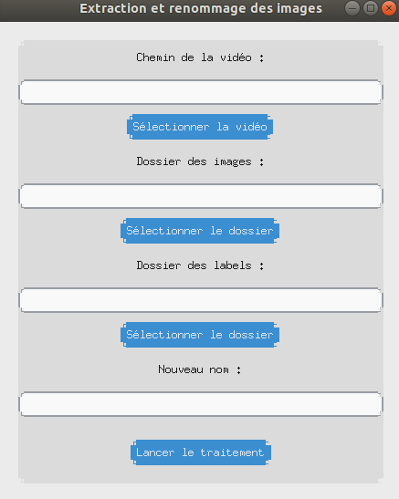

# Table of Contents

- [The Objective of This Project](#the-objective-of-this-project)
- [📊 Creation of DataSet](#creation-of-dataset)
- [Training Phase and Results](#training-phase-and-results)
  - [The Metrics](#the-metrics)
  - [The Parameters](#the-parameters)
- [🛠️ How to Use It](#️how-to-use-it)
  - [Create the Train and Validation Datasets](#create-the-train-and-validation-datasets)
    - [Annotation with CVAT](#annotation-with-cvat)
    - [Re-Numerate Class Numbers](#re-numerate-class-numbers)
    - [Rename Image and Label Files](#rename-image-and-label-files)
    - [Organize Dataset into Train and Test Folders](#organize-dataset-into-train-and-test-folders)
  - [Upgrade the Model](#upgrade-the-model)
  - [Inference](#inference)
- [📚 References](#references)
  - [Datasets](#datasets)
  - [Model](#model)
  - [Software](#software)

## The objectif of this project

The main objective of this project is to allow real-time inference of underwater species. The Institucam films in real time, and the objective is to perform annotations in real time on the flow or to perform annotations on the samples where movement has been detected. To achieve this, I used the Tenaka model as a base and upgraded it to make it better suited for real conditions, such as detecting species under poor conditions, low-quality images, and so on. Additionally, I upgraded the model and created an API to improve the efficiency of treatment and avoid loading the model each time inference is performed.

 
## 📊 Creation of DataSet

The study and different tests that I can try to do show that the best results are achieved as follows. 30% of the dataset is used to show the features of the species, allowing the model to train on each species's particular features. This allows the model to know, for example, that sharks have some fins here, some gills here, etc. It also helps to avoid overfitting. Additionally, 10% of the dataset consists of other species to avoid overfitting and make the model better by forcing it to make some errors in predictions and recalibrate. Finally, 60% of the dataset is used in real conditions to train the model on what it will face in real life, especially when the buoys are set up on the water.

Then the creation of the global dataset is simple. I annotated some images for a given species, associated the correct class number in the configuration files and in the label files. Once I completed my dataset for each species that I wanted, I merged all of the datasets to create the global dataset with all the species.

<!--  -->

## Training Phase and Results

In this section, we will discuss the results obtained from our model, which are quite promising. We'll also cover how to interpret these results and ways to improve the model further.

### The Metrics

#### Precision-Recall (PR) Curve

The Precision-Recall (PR) curve is a crucial metric for evaluating classification models, especially in cases of class imbalance. Here’s a detailed explanation:

#### Precision and Recall

- **Precision**: Precision measures the ratio of true positive predictions to the total number of positive predictions made by the model. It answers the question: "Of all the instances the model predicted as positive, how many were actually positive?" The formula for precision is given by:

  $$
  \text{Precision} = \frac{\text{True Positives}}{\text{True Positives} + \text{False Positives}}
  $$

- **Recall**: Recall (also known as sensitivity or the true positive rate) is the ratio of true positive predictions to the total number of actual positives in the dataset. It answers the question: "Of all the actual positive instances, how many were correctly identified by the model?" The formula for recall is:

  $$
  \text{Recall} = \frac{\text{True Positives}}{\text{True Positives} + \text{False Negatives}}
  $$

#### PR Curve

The PR curve plots precision against recall for various threshold values of the model's output probabilities. Here’s why it’s important:

1. **Trade-off Between Precision and Recall**: The PR curve shows the trade-off between precision and recall. As the threshold for classifying an instance as positive changes, both precision and recall values vary.

2. **Area Under the Curve (AUC-PR)**: The area under the PR curve (AUC-PR) provides a single scalar value that summarizes the model's performance. An AUC-PR close to 1 indicates high precision and recall across different thresholds.

3. **Imbalanced Classes**: The PR curve is especially useful for imbalanced datasets where the number of positive instances is much smaller than the number of negative instances. It provides a more informative view of model performance compared to the ROC curve.

#### Interpretation

- **Ideal Model**: An AUC-PR of 1 indicates a perfect model with both high precision and recall. This means all positive predictions are correct, and all actual positives are identified.

- **Real-world Scenarios**: In practice, the PR curve helps understand the model's performance at various operating points. For instance, in medical diagnostics, high recall might be prioritized to avoid missing any positive cases.

### Example

Consider a model predicting the presence of sharks in images. If the PR curve has an area close to 1, it implies:

- When the model predicts a shark, it is nearly always correct (high precision).
- The model correctly identifies almost all actual shark images (high recall).

### Optimization in CNNs

In Convolutional Neural Networks (CNNs), optimizing the PR curve involves:

1. **Threshold Tuning**: Adjusting the decision threshold to balance precision and recall based on specific application needs.

2. **Model Architecture**: Designing robust CNN architectures that handle class imbalances, possibly through class-weighted loss functions or data augmentation.

3. **Evaluation Metrics**: Regularly monitoring the PR curve during training and validation to ensure improvements in both precision and recall.

By focusing on the PR curve, you ensure that your CNN model is accurate and reliable in real-world scenarios where the costs of false positives and false negatives may vary significantly.

### The parameters

## 🛠️ How to use it

First of all for all code that you are launching, assure yourslef to be in the src folder of the project.

### Create the train and validation datasets

To simplify the process of dataset creation, I developed several modules.

#### Annotation with CVAT

For annotating the dataset, I used CVAT, which can be accessed at [this address](https://app.cvat.ai/tasks). CVAT facilitates easier annotation and provides label files in `.txt` format.

#### Re-Numerate Class Numbers

Once you have obtained the labels, the first step is to modify the class numbers in all the label files from CVAT. Due to the methodology I used—annotating species individually—the class number in the label files is always set to 0. However, in datasets like MegaFauna, different species (e.g., ray vs. shark) have different class numbers.

To address this, I developed a tool called `ediClass.py`. This tool allows you to:

1. Select the folder containing all the label files.
2. Define the desired class numbers.

`ediClass.py` will then automatically update the class numbers in all the files accordingly.

you can see the UI on the following picture. You have to choose the path folder, the number of the class for the associated species and click on run.

#### Rename Image and Label Files

With your labels updated with the correct class numbers, the next step is to organize your dataset into two folders: one for images and one for videos. This process involves transforming and renaming the image files extracted from the annotated video, and storing them in your chosen directories with appropriate names.

The purpose of `renameImage.py` tool is to:

1. Extract each image from the video used for annotations.
2. Save the images in a folder of your choice.
3. Rename the image and label files with names you define.

This helps in easily identifying the images and avoids name duplication across the dataset.

##### Steps to Use the Tool:

1. **Enter Video Path:**
   - Type the path to the annotated video file manually (as `.mp4` files may not appear in the file explorer).

2. **Select Label Repository:**
   - Use the file explorer to navigate to the repository that will contains the images extract from the video. Ensure you have created an empty folder for images.

3. **Define Naming Convention:**
   - Choose the folder where the labels are stored.
   - Specify the names you want for the image and label files.

Follow these steps to organize and rename your dataset files effectively.

#### Organize Dataset into Train and Test Folders

At this stage, you should have two folders: one for images and one for labels. The next objective is to create `train` and `val` (validation) folders.

To achieve this, follow these steps:

1. **Run `train.py`:**
   - Launch the `train.py` script.

2. **Configure Settings:**
   - In the script, set the `value choice` to `1`.
   - Modify the `image path` to point to the images folder you created earlier.
   - Set the `labels path` to point to the labels folder.
   - Specify the `output folder` where the `train` and `val` folders will be created.

By following these steps, `train.py` will organize your dataset into `train` and `val` folders, ready for model training and evaluation.

### Upgrade the model

The most important thing to keep in mind is the following: make sure that your overall dataset, containing all species, is always located in one of these paths:

- **MegaFauna Dataset:**  
  `/media/hdd_stockage/home/user/SpeciesDetection/marine-detect/DataSet/MegaFauna-dataset/notebooks/datasets/MegaFauna/test`

- **FishInv Dataset:**  
  `/media/hdd_stockage/home/user/SpeciesDetection/marine-detect/DataSet/FishInv-dataset/notebooks/datasets/FishInv/test`

By keeping your dataset in these directories, you won't need to modify the `.yaml` file, as the paths are already defined.

### Upgrading the Model

To upgrade the model, you have two options:

1. **Custom Hyperparameters:**
   - Adjust the hyperparameters as per your requirements in the `train.py` script.
   - Set the `choice` variable to `2`.

2. **Automated Hyperparameter Tuning:**
   - This option is more effective but takes longer.
   - Set the `choice` variable to `3`.
   - This will initiate the training process multiple times (default is 10 iterations), automatically adjusting the hyperparameters at each iteration to find the optimal configuration for improving the model's performance.

### Inference

The final step, and the one that interests us most, is the inference process. Here’s how to perform inference using your model:

1. **Start the API:**
   - Run `SpeciesDetectionAPI.py` to start the API. This script will load the models only once, ensuring efficient processing.

2. **Make Predictions:**
   - Execute `makePrediction.py` with the appropriate choice parameter:
     - **`choice=1`** for image annotation.
     - **`choice=2`** for video annotation.

   - The paths for images and videos are typically pre-configured, so no modifications should be necessary. However, you can change these paths if needed.

 
## 📚 References

### Datasets
 
- Ticon Dataset. (2023). Shark Dataset [ Open Source Dataset ]. In Roboflow Universe . Roboflow . https://universe.roboflow.com/ticon-dataset/shark-ibmby
- Minhajul Arefin. (2021).  zebra_shark Dataset  [ Open Source Dataset ]. In  Roboflow Universe .  Roboflow . https://universe.roboflow.com/minhajul-arefin/zebra_shark
- Rizal Fadia Al Fikri. (2022).  shark_species Dataset  [ Open Source Dataset ]. In  Roboflow Universe .  Roboflow . https://universe.roboflow.com/rizal-fadia-al-fikri/shark_species
- Aya Abd-Elnaser. (2022).  SHARK Dataset  [ Open Source Dataset ]. In  Roboflow Universe .  Roboflow . https://universe.roboflow.com/aya-abd-elnaser/shark-jatfb
- Nomi. (2023).  seaturtle Dataset  [ Open Source Dataset ]. In  Roboflow Universe .  Roboflow . https://universe.roboflow.com/nomi/seaturtle
- Parvej Hosen. (2022).  Turtle Dataset  [ Open Source Dataset ]. In  Roboflow Universe .  Roboflow . https://universe.roboflow.com/parvej-hosen/turtle-f9xgw
- Seami New 5 Fishes. (2023).  EagleRay New Dataset  [ Open Source Dataset ]. In  Roboflow Universe .  Roboflow . https://universe.roboflow.com/seami-new-5-fishes/eagleray-new
- Le Wagon. (2023).  count-a-manta Dataset  [ Open Source Dataset ]. In  Roboflow Universe .  Roboflow . https://universe.roboflow.com/le-wagon-w02yl/count-a-manta
- Renaldo Rasfuldi. (2022).  fish_id_2 Dataset  [ Open Source Dataset ]. In  Roboflow Universe .  Roboflow . https://universe.roboflow.com/renaldo-rasfuldi/fish_id_2
- Universiti Teknologi Malaysia. (2023).  Giant Clam Dataset  [ Open Source Dataset ]. In  Roboflow Universe .  Roboflow . https://universe.roboflow.com/universiti-teknologi-malaysia-juyvx/giant-clam
- Universiti Teknologi Malaysia. (2023).  Tioman Giant Clams Dataset  [ Open Source Dataset ]. In  Roboflow Universe .  Roboflow . https://universe.roboflow.com/universiti-teknologi-malaysia-juyvx/tioman-giant-clams
- Jacob Solawetz. (2023).  Fish Dataset  [ Open Source Dataset ]. In  Roboflow Universe .  Roboflow . https://universe.roboflow.com/roboflow-gw7yv/fish-yzfml
- Dataset. (2022).  Dataset Dataset  [ Open Source Dataset ]. In  Roboflow Universe .  Roboflow . https://universe.roboflow.com/dataset-gdypo/dataset-axhm3
- Addison Howard, W. K., Eunbyung Park. (2018). ImageNet Object Localization Challenge. Kaggle. https://kaggle.com/competitions/imagenet-object-localization-challenge
- Australian Institute of Marine Science (AIMS), University of Western Australia (UWA) and Curtin University. (2019), OzFish Dataset - Machine learning dataset for Baited Remote Underwater Video Stations, https://doi.org/10.25845/5e28f062c5097

### Model

- Jocher, G., Chaurasia, A., & Qiu, J. (2023). Ultralytics YOLO (Version 8.0.0) [Computer software]. https://github.com/ultralytics/ultralytics

### Software

- Charles, Eléonore. (2024). marine-detect: Object Detection Models for Identifying Species in Marine Environments [Software]. Version 0.0.1. AGPL-3.0. [https://github.com/Orange-OpenSource/marine-detect](https://github.com/Orange-OpenSource/marine-detect)
